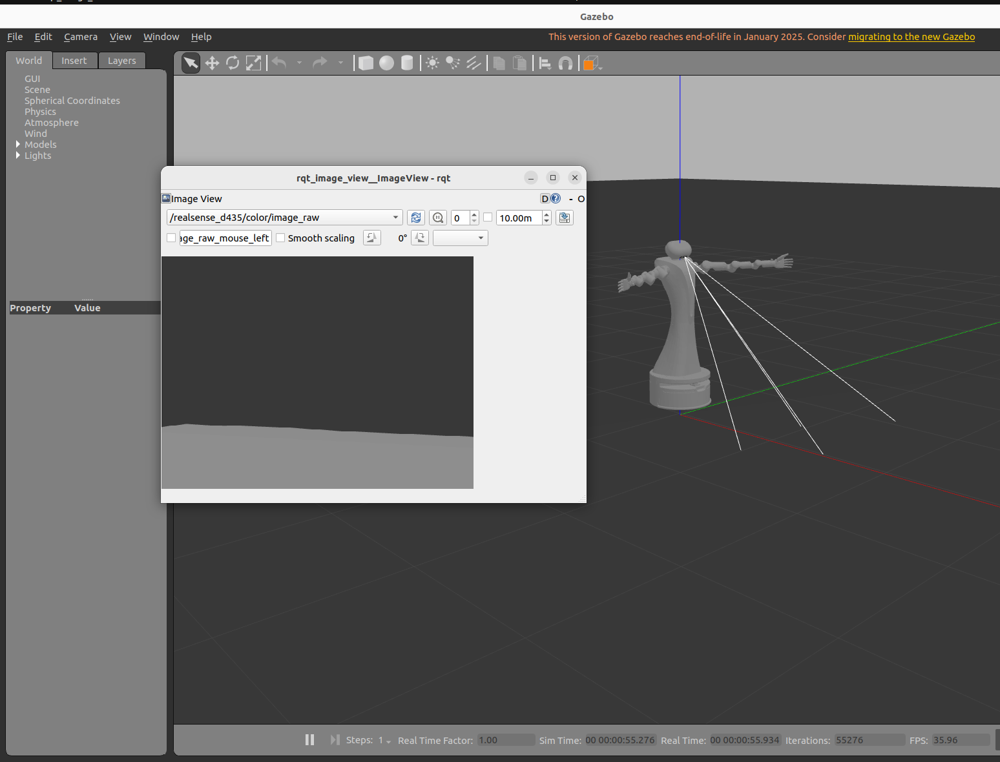
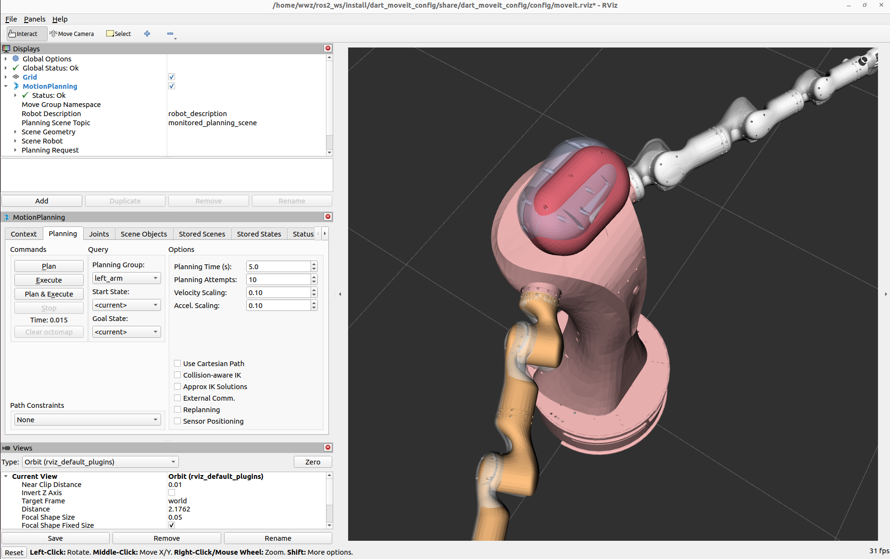

# AIML DART (ROS2 + MoveIt2 + RGB-D Perception)

This repository contains a full ROS2-based simulation and control stack for the AIML DART robot, including motion planning, perception, and manipulation capabilities.

---

## 🚀 Current Status

The system has reached a **functional research-ready stage**:

* ✅ Full URDF model (dual arms, hands, head, mobile base)
* ✅ `ros2_control` integration (joint-level control)
* ✅ MoveIt2 motion planning (left/right arms)
* ✅ RGB-D camera simulation (RealSense D435)
* ✅ Depth → PointCloud pipeline
* ✅ MoveIt → controller → Gazebo execution pipeline

⚠️ Notes:

* Motion execution is functional but not yet fully stabilised (controller tuning pending)
* Mobile base movement is not yet finalised
* Grasp pipeline is under development

---

## 🧠 System Overview

The system architecture follows a standard robotics pipeline:

```
Perception (RGB-D)
        ↓
3D Representation (PointCloud)
        ↓
Motion Planning (MoveIt2)
        ↓
Execution (ros2_control)
        ↓
Gazebo Simulation
```

---

## 📸 System Demo
These figures demonstrate the integrated simulation pipeline, including RGB perception in Gazebo and motion planning via MoveIt2.

### Gazebo Simulation + RGB Camera



---

### MoveIt2 Motion Planning (Arm Control)



---

## 📦 Workspace Structure

```
ros2_ws/
  src/
    dart_description/      # URDF, meshes, controllers, Gazebo launch
    dart_moveit_config/    # MoveIt2 configuration
```

---

## ⚙️ Installation

```bash
# Clone repository
git clone https://github.com/WenzeWWZ123/aiml_dart.git

cd aiml_dart

# Build workspace
cd ~/ros2_ws
colcon build
source install/setup.bash
```

---

## ▶️ Running the System

### 1. Launch Gazebo Simulation

```bash
ros2 launch dart_description gazebo.launch.py
```

---

### 2. Load Controllers

```bash
ros2 control load_controller --set-state active joint_state_broadcaster
ros2 control load_controller --set-state active left_arm_controller
ros2 control load_controller --set-state active right_arm_controller
```

---

### 3. Launch MoveIt2

```bash
ros2 launch dart_moveit_config demo.launch.py
```

---

## 🤖 Using MoveIt2

In RViz:

1. Select a planning group (`left_arm` or `right_arm`)
2. Drag the end-effector marker
3. Click:

   ```
   Plan → Execute
   ```

If configured correctly, the robot will execute the motion in Gazebo.

---

## 🎥 Perception

Available topics:

```bash
/realsense_d435/color/image_raw
/realsense_d435/depth/image_raw
/realsense_d435/depth/points
```

Visualisation:

```bash
ros2 run rqt_image_view rqt_image_view
rviz2  # for point cloud
```

---

## ⚠️ Known Limitations

* Controller PID parameters are not tuned (may cause oscillations)
* Mobile base is currently fixed / unstable when enabled
* No grasp pipeline yet (perception → manipulation integration pending)

---

## 🔜 Future Work

* [ ] Stable control (PID tuning)
* [ ] Grasp pipeline (perception → planning → execution)
* [ ] Mobile base integration
* [ ] Full system launch automation
* [ ] Real robot deployment

---

## 🧪 Research Direction

This project is being extended toward:

> **Execution-aware robotic manipulation and agentic control loops**

including:

* perception-driven action
* execution monitoring
* recovery strategies

---

## 📬 Contact

Wenze Wang
* Australian Institute for Machine Learning (AIML) · Adelaide University
* wenze.wang@student.adelaide.edu.au

---

## ⭐ Acknowledgement

We would like to sincerely thank [Mehdi Hosseinzadeh](https://github.com/m80hz) for his foundational work on the [AIML DART](https://github.com/m80hz/aiml_dart) robot system.

This project builds upon the original implementation from aiml_dart and extends it towards a fully integrated robotics framework with ROS2, MoveIt2, and perception modules.

We greatly appreciate his contributions, which made this work possible.
